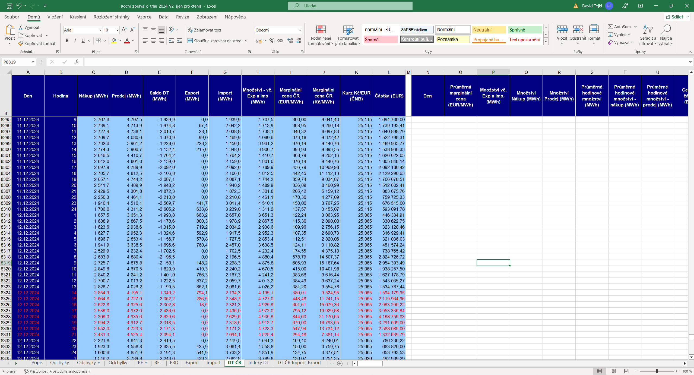

# Energy Crisis Cost Analysis (Czech Republic, 2020–2024)

**English** · [Čeština](README_cz.md)

**In 2022 the electricity traded on the Czech day-ahead market was worth 7.5 times more than in 2020,
while the traded volume grew by only 8 % — the price did almost all of it.**

`Python (pandas, requests, pyodbc)` · `SQL Server / T-SQL` · `star schema` · `data quality tests` · `Power BI`

How much did the 2021–2023 energy crisis cost a Czech company, what drove the cost (market price, volume,
load shape, EUR/CZK) and could it have been hedged? This repository answers that question step by step,
from raw public data to a SQL Server star schema and analysis queries.

> **Status — version 1:** pipeline, data model, data-quality checks and market price analysis are done.
> The company cost (all-in price), the cost drivers, the hedging scenarios and the Power BI report come next.

## The problem

- **Scenario (fictional):** an energy-intensive Czech company with a three-shift operation and a lower weekend load
  buys electricity at the day-ahead spot price.
- **Stakeholders:** the CFO (cost and budget risk) and energy purchasing (fix the price now, or wait?).
- **Decision:** how much of next year's volume to fix in advance.
- Business questions and scope: [docs/01_project_brief.md](docs/01_project_brief.md)

## Data

| Source | What | Granularity | Period |
|---|---|---|---|
| [OTE-ČR](https://www.ote-cr.cz/cs/statistika/rocni-zprava) yearly market report (V2, final settlement) | day-ahead price EUR/MWh, volume MWh | hourly | 2020–2024 |
| [ČNB](https://www.cnb.cz/cs/financni-trhy/devizovy-trh/kurzy-devizoveho-trhu/) exchange rates | EUR/CZK | ČNB working days | 2019–2024 |
| [ČNB](https://www.cnb.cz/cs/casto-kladene-dotazy/.galleries/vyvoj_repo_historie.txt) 2-week repo rate | policy interest rate | validity periods | 2019–2024 |

- 43,848 hourly prices in 1,827 days. Days with a daylight-saving change have 23 or 25 hours.
- Weekend and holiday exchange rates are filled from the last ČNB working day
  ([ADR-001](docs/decisions/ADR-001-eur-czk-fill-rule.md)); every filled row is flagged.
- The company's load profile will be **simulated** (real load curves are trade secrets) and labelled as such.
- The data is not stored in this repository. The scripts download it from OTE and ČNB, so the `data/` folders
  are empty until you run them.

## Architecture

```
download (Python)  →  data/bronze   raw files, never edited
transform (Python) →  data/silver   cleaned CSV, one file per table
load (Python)      →  SQL Server    star schema: fact_energy_prices, fact_fx, dim_date, dim_hour, repo_rate
analysis (T-SQL)   →  view vw_energy_prices_czk + queries sql/04–07
```

```
python/    01_extract · 02_transform · 03_load · config.py (paths and constants)
sql/       01–03 database, tables, views · 04–07 analysis queries · 91 data quality tests
docs/      brief, data model, KPI definitions, data quality report, findings, decisions (ADRs)
config/    regulated price components with validity periods (next version)
data/      bronze (raw) · silver (cleaned) — rebuilt by the scripts, not stored in git · gold (next version)
powerbi/   Power BI report as PBIP (next version)
```

- Data model with the grain of every table: [docs/data_model.md](docs/data_model.md)
- KPI definitions (price bands): [docs/kpi_definitions.md](docs/kpi_definitions.md)
- Data quality checks (27 tests) and results: [sql/91_dq_tests.sql](sql/91_dq_tests.sql),
  [docs/data_quality_report.md](docs/data_quality_report.md)
- Decisions: [docs/decisions/](docs/decisions/)

## How to run

Requirements: Windows, Python 3.13, SQL Server (local default instance, Windows authentication),
ODBC Driver 17 for SQL Server, `sqlcmd`.

```bash
# 1. Python environment
py -m venv .venv
source .venv/Scripts/activate    # Git Bash; in PowerShell: .venv\Scripts\Activate.ps1
pip install -r requirements.txt

# 2. Download and clean the data
py python/01_extract.py          # raw files into data/bronze (a second run skips existing files)
py python/02_transform.py        # cleaned CSV into data/silver

# 3. Database and load
sqlcmd -S localhost -E -C -b -f 65001 -i sql/01_create_database.sql
sqlcmd -S localhost -E -C -b -f 65001 -i sql/02_create_tables.sql
py python/03_load.py             # full reload in one transaction

# 4. View, data quality checks and analysis
sqlcmd -S localhost -E -C -b -f 65001 -i sql/03_create_views.sql
sqlcmd -S localhost -E -C -b -f 65001 -i sql/91_dq_tests.sql
sqlcmd -S localhost -E -C -b -f 65001 -i sql/04_query_daily_overview.sql
```

Expected row counts after the load: `dim_date` 1,827 · `dim_hour` 25 · `repo_rate` 22 ·
`fact_energy_prices` 43,848 · `fact_fx` 1,827.

## Key findings (market prices, version 1)

All numbers come from the queries named in [docs/findings.md](docs/findings.md).

1. **The price, not the volume, made the crisis.** The value traded on the day-ahead market rose from
   20.7 bn CZK (2020) to 155.8 bn CZK (2022), while the volume grew only from 22.4 to 24.3 TWh (+8 %).
   (`sql/04_query_daily_overview.sql`)
2. **Expensive hours became the normal.** In 2020 only 1 hour cost 3,374 CZK/MWh or more; in 2022 it was
   6,951 hours, 79 % of the year. (`sql/05_query_price_bands.sql`)
3. **The crisis ended, the spikes did not.** The most expensive hour of 2024 (12 Dec, 17:00–18:00,
   21,171 CZK/MWh) was almost as high as the crisis peak (29 Aug 2022, 21,422 CZK/MWh). But 2022 was a long
   period of high prices — its 5 most expensive days all fell in one week of late August — while 2024 was
   a short shock of a few hours. (`sql/07_query_top_hours.sql`)

### Data quality example: an outlier is not an error

The first data-quality run flagged 12 December 2024, 17:00–18:00: **844.63 EUR/MWh**, far above the same hour
on the days before (199.29 and 442.45 EUR/MWh). The value is in the raw OTE file, the file's own derived columns
agree (844.63 × 25.065 = 21,170.65 CZK/MWh) and the price rises and falls smoothly over the whole evening.
The same hour was the peak of a *Dunkelflaute* (cold, windless, dark weather with very low renewable output)
in Germany, where the day-ahead price reached 936 EUR/MWh; the Czech and German markets are coupled.
The value is a real market price and stays in the data — outliers are verified against the source, not removed.



## Limits

- **Market prices only so far.** Version 1 analyses the day-ahead market; the company cost with distribution,
  system services, renewables support (POZE), taxes and the 2023 state price cap comes in the next version.
- **Simple averages.** Daily and yearly prices in version 1 are simple averages of the hours (base price).
  The company cost will use the volume-weighted price.
- **Simulated load.** The company's load profile will be simulated; findings about volume and load shape will
  reflect the assumptions of the generator, not a real company.
- **No forward prices.** OTE publishes no forward prices; any hedging price will be a documented proxy,
  not a real contract price.
- **Correlation is not causation.** Dates of price or exchange-rate jumps are compared with market events,
  but the data alone does not prove the cause.
- Local SQL Server only; no cloud deployment.
